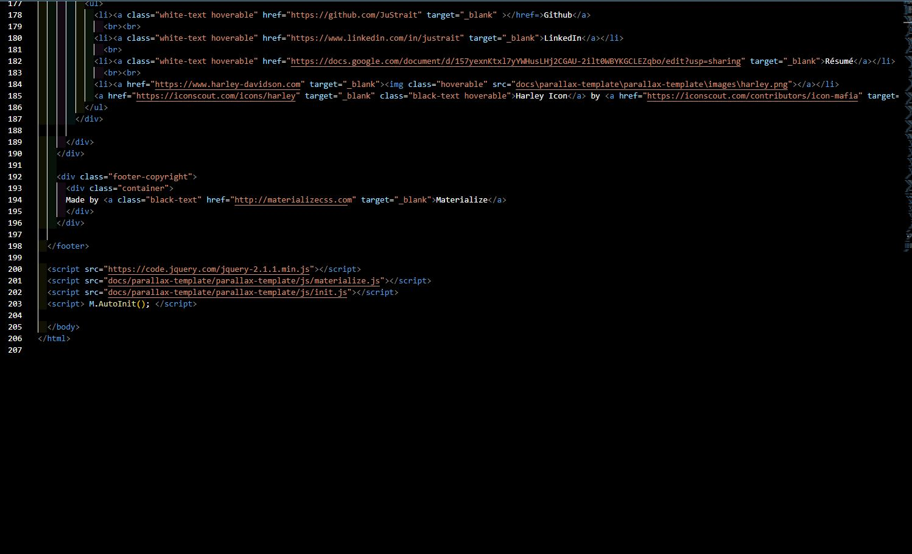

# MySelf

### Criteria

Our goal for this assignment was to incorporate a new, updated, and dynamic bio to mesh with our previous.
I used Materialize framework for my site and incoporated all the required criteria. 
Enjoy

### Here is the [Github Repo](https://github.com/JuStrait/MySelf) 

### Here is the [Deployed Page](https://justrait.github.io/MySelf/)

